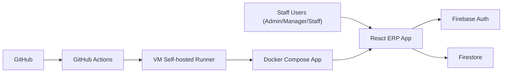

# SYSTEM OVERVIEW (Mermaid)

```mermaid
flowchart LR
  A["Staff Users (Admin/Manager/Staff)"] --> B["React ERP App"]
  B --> C["Firebase Auth"]
  B --> D["Firestore"]
  E["GitHub"] --> F["GitHub Actions"]
  F --> G["VM Self-hosted Runner"]
  G --> H["Docker Compose App"]
  H --> B
```
